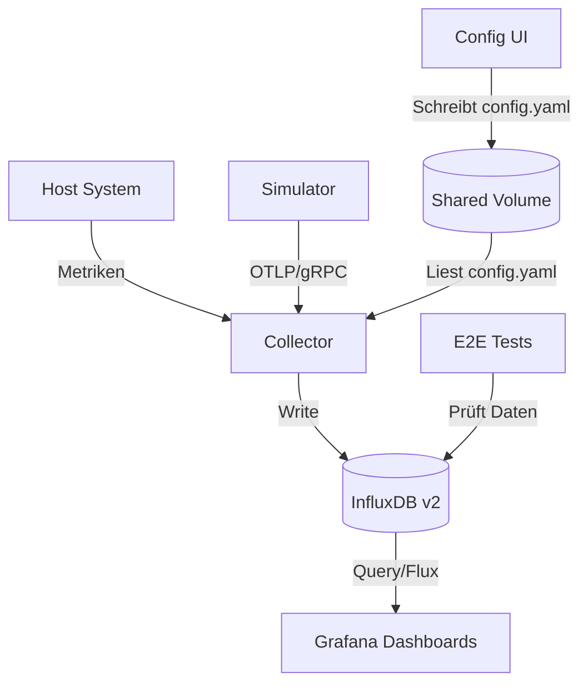

# Architektur

Die Systemarchitektur basiert auf einer containerisierten Microservice-Struktur.

## Datenfluss

1.  Der **Simulator** erzeugt sekündlich künstliche Metriken.
2.  Der **Hostmetrics Receiver** im Collector liest Systemdaten des Hosts.
3.  Der **Custom OTel Collector** verarbeitet diese Daten (Batching) und sendet sie an **InfluxDB**.
4.  **Grafana** visualisiert die Daten mittels vordefinierter Dashboards.
5.  Die **Config UI** ermöglicht es, die Pipeline des Collectors zur Laufzeit anzupassen.
